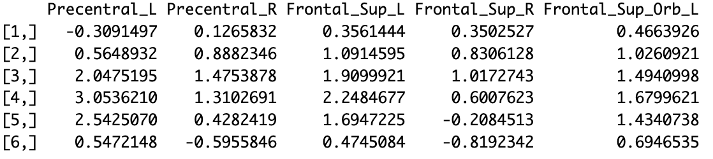
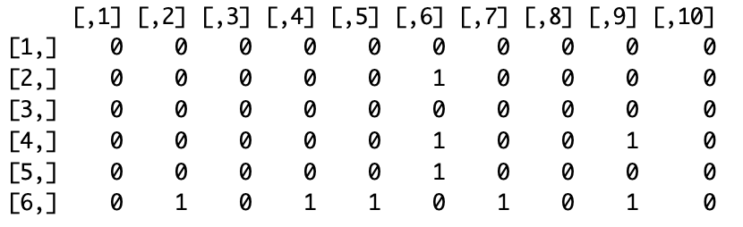

## Introduction

In this section, we will show you how to use our functions to calculate the number of edge for certain combination of frequencies and networks. 

### Data

The data we will use is `0010020_roi_aal_mask_pad.csv`, which is a rs-fMRI dataset for an adhd patient from the ADHD-200 Sample repository. For more information about this repository, please visit [ADHD-200 Preprocessed](preprocessed-connectomes-project.org/adhd200/).

### Functions

Here we will use four functions, `fdft`, `freal`, `f_para_boot`, and `f_all`.

Below are all the arguments in `fdft`. `x` is a time series vector and `w` is a specific frequency.

```{}
fdft(x, w)
```

Below are the arguments in `freal`. `data` is a weakly stationary time series matrix and `w` is a specific frequency.

```{}
freal(data, w)
```

Below are the three arguments in `f_para_boot`. `x` is the real part (a matrix) of spectral density. `alpha` is the significance level. `B` is the number of iterations.

```{}
f_para_boot(x, alpha, B)
```

Below are all the arguments in `f_all`. `x` is the standardized time series matrix. `y` is the length of a frequency vector. `alpha` is the significance level.

```{}
f_all(x, y, alpha)
```

### Application

```{}
# read in data and labels
adhd <- read.csv("0010020_roi_aal_mask_pad.csv", header = T)
library(readxl)
name0 <- read_excel("aal_labels.xlsx",col_names = F)

# specify frequencies
freq0 <- seq(0.01, 0.2, 0.01)
length(freq0)
freq0
```


```{}
# manipulate data
adhd_name <- adhd[,1]
adhd1 <- t(adhd[,-1])
rownames(adhd1)<-NULL
colnames(adhd1) <- name0[,2]

# standardize data
fnorm <- function(x){(x-mean(x,na.rm = T))/sd(x,na.rm = T)}
adhd2 <- apply(adhd1, 2, fnorm)
head(adhd2[,1:5])
```



```{}
# apply function `fdft` to calculate DFT for a time series matrix
dft_result <- apply(adhd2, 2, function(x)fdft(x, w = 0.2))

# apply function `freal` to get the real part of DFT
real_result <- freal(adhd2, w = 0.2)

# apply function `f_para_boot` to get the bootstrap CIs and estimated values for element in the real part (a matrix)
boot_result <- f_para_boot(real_result, alpha = 0.01, B = 1000)

# apply function `f_all` to a range of frequencies
result <- lappy(1:length(freq0), function(x)f_all(adhd2, x, alpha = 0.01))
head(result[[1]][,1:10])
```


